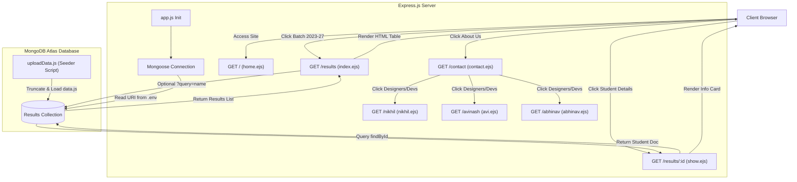

# 🎓 BiT Results Portal

Welcome to the **BiT Results Portal**, a robust, light-weight, and highly-responsive web application designed to manage, search, and visualize academic results for the student batch of **2023–2027**. 

Built with the modern **MERN (specifically MEN - MongoDB, Express, Node.js)** stack and rendered dynamically using **EJS (Embedded JavaScript Templates)** with styling powered by **Bootstrap 5**, this application serves as an interactive platform for students, faculty, and stakeholders to search and view semester-wise SGPA scores.

---

## 🗺️ Table of Contents
1. [Key Features](#-key-features)
2. [Technology Stack](#-technology-stack)
3. [Project Directory Structure](#-project-directory-structure)
4. [System Flow Diagram](#-system-flow-diagram)
5. [Database Schema Design](#-database-schema-design)
6. [API & Routing Reference](#-api--routing-reference)
7. [Detailed Implementation Breakdown](#-detailed-implementation-breakdown)
8. [Installation & Setup Guide](#-installation--setup-guide)
9. [Team & Credits](#-team--credits)

---

## 🌟 Key Features

* **Instant Dynamic Search**: Retrieve student results instantly using regex-based case-insensitive pattern matching on student names.
* **Responsive Visual Tables**: High-quality Bootstrap table layouts mapping student profiles and department information cleanly.
* **Detailed Academic Record Cards**: Dedicated profile pages showcasing individual student metrics, including Semester 1 & Semester 2 SGPA.
* **One-Click Database Seeding**: Automated script to clear and re-initialize the MongoDB database with default student records.
* **Environment-Driven Configuration**: Highly secure configuration management via `.env` files using `dotenv`.

---

## 🛠️ Technology Stack

* **Runtime Environment**: [Node.js](https://nodejs.org/) (v22.8.0)
* **Backend Framework**: [Express.js](https://expressjs.com/) (v4.21.2)
* **Database & ORM**: [MongoDB Atlas](https://www.mongodb.com/) via [Mongoose](https://mongoosejs.com/) (v9.6.2)
* **Template Engine**: [EJS](https://ejs.co/) (v3.1.10)
* **Frontend CSS Framework**: [Bootstrap](https://getbootstrap.com/) (v5.3.3)
* **Social Media Icons**: [Font Awesome](https://fontawesome.com/) (v6.0.0 / v6.7.1)

---

## 📂 Project Directory Structure

Below is the directory tree mapping the files and folders utilized in the implementation:

```text
git-Bit-result/
├── README.md                 # Project documentation
└── bit-results/              # Active server codebase
    ├── .env                  # Environment configurations (ATLASDB_URI)
    ├── .gitignore            # Git exclusion rules
    ├── app.js                # Core server configuration and routing logic
    ├── data.js               # Initial seeding data with 100+ student records
    ├── package.json          # Dependency definitions and Node.js metadata
    ├── uploadData.js         # Script to clear and seed the MongoDB database
    ├── models/
    │   └── res.js            # Mongoose Schema mapping the Student Result structure
    ├── public/
    │   └── CSS/
    │       └── style.css     # Global custom CSS rules
    └── views/
        └── results/
            ├── abhinav.ejs   # Bio & Social handles for Abhinav Nayak (Data Collector)
            ├── avi.ejs       # Bio & Social handles for Avinash Som (Developer)
            ├── contact.ejs   # About Us page details & project team structure
            ├── home.ejs      # Landing page for Batch (2023-27) results selection
            ├── index.ejs     # Results listing index page with dynamic search input
            ├── nikhil.ejs    # Bio & Social handles for Nikhil Pundir (Designer & Tester)
            ├── r.ejs         # Legacy navigation reference layout
            └── show.ejs      # Student-specific dashboard displaying roll, department, & SGPAs
```

---

## 🔄 System Flow Diagram

The flowchart below demonstrates the architectural layout, page redirections, and CRUD/Search flows between the Client browser, the Express.js routing controller, and the MongoDB Atlas database.



---

## 🗃️ Database Schema Design

The student result collection schema is managed using Mongoose. The model schema is defined inside `models/res.js` under the `res` collection name.

| Field Name | Data Type | Description |
| :--- | :--- | :--- |
| `Sr` | `Number` | Unique Serial/Sequence Number of the student record. |
| `name` | `String` | Full Name of the student. |
| `roll` | `Number` | Unique University Roll Number. |
| `dept` | `String` | Academic Department (e.g., `"CSE"`, `"ECE"`). |
| `SGPASem1` | `Number` | Semester 1 Semester Grade Point Average (SGPA). |
| `SGPASem2` | `Number` | Semester 2 Semester Grade Point Average (SGPA). |

---

## 🌐 API & Routing Reference

The server exposes the following endpoints:

| Method | Endpoint | Description | Query Parameters / Params | Rendered Template |
| :--- | :--- | :--- | :--- | :--- |
| **GET** | `/` | Portal Welcome / Entry page | None | `home.ejs` |
| **GET** | `/results` | List of results / Search index page | `query` (Optional Search string) | `index.ejs` |
| **GET** | `/results/:id` | Detailed SGPA metrics for a single student | `id` (Mongoose ObjectId) | `show.ejs` |
| **GET** | `/contact` | Summary of the website and developer roles | None | `contact.ejs` |
| **GET** | `/nikhil` | Portfolio details of Designer Nikhil Pundir | None | `nikhil.ejs` |
| **GET** | `/avinash` | Portfolio details of Developer Avinash Som | None | `avi.ejs` |
| **GET** | `/abhinav` | Portfolio details of Data Collector Abhinav Nayak | None | `abhinav.ejs` |

---

## 🔍 Detailed Implementation Breakdown

### 1. Database Connection & Server Setup (`app.js`)
Configured to load environment settings using `dotenv.config()`. It initializes an Express server, establishes connection to the cloud database (MongoDB Atlas) using Mongoose, and sets up EJS as the default template engine. Assets (CSS) are served statically from `/public`.

### 2. Search Integration
In `/results` endpoint, query parameters are processed:
```javascript
const { query } = req.query;
const searchCriteria = query
    ? {
        $or: [
            { name: { $regex: query, $options: 'i' } }, 
        ]
      }
    : {};
const filteredResults = await result.find(searchCriteria);
```
This enables real-time search functionality. It returns any student records matching the queried name prefix or pattern, ignoring letter case.

### 3. Database Seeding Script (`uploadData.js`)
An administrative utility script which:
* Loads configurations and establishes a direct connection to MongoDB.
* Deletes all documents within the results collection via `Result.deleteMany({})`.
* Reads the structured array exported in `data.js` and bulk-inserts them via `Result.insertMany(initData.data)`.
* Closes connection automatically upon success/failure.

### 4. Interactive Pages (Views)
* **`home.ejs`**: Features navigation and a primary Call to Action (CTA) button to select results for the 2023-27 batch.
* **`index.ejs`**: Displays results within a dynamic table layout and features a real-time search form.
* **`show.ejs`**: Visualizes a clean tabular breakdown detailing Sem-1 and Sem-2 performance records.
* **`contact.ejs`**: Introduces the team members behind the portal design, data collation, testing, and deployment.

---

## ⚙️ Installation & Setup Guide

### 📂 Prerequisites
Ensure you have **Node.js** and **npm** installed on your operating system.

### 📝 Step-by-Step Installation

1. **Clone the Repository**:
   ```bash
   git clone <repository_url>
   cd git-Bit-result/bit-results
   ```

2. **Install Dependencies**:
   ```bash
   npm install
   ```

3. **Configure Environment Variables**:
   Create a `.env` file inside the `bit-results` folder:
   ```env
   ATLASDB_URI=mongodb+srv://<username>:<password>@cluster0.mongodb.net/bitResults?retryWrites=true&w=majority
   ```

4. **Seed the Database**:
   Populate your MongoDB Atlas cluster with the student list:
   ```bash
   node uploadData.js
   ```

5. **Start the Application**:
   Launch the Express web server locally:
   ```bash
   node app.js
   ```
   Open your browser and navigate to `http://localhost:8080`.

---

## 👥 Team & Credits

This project was built and published by:
* **Nikhil Pundir**: Primary Developer & Deployment Lead. ([GitHub Profile](https://github.com/nikhilpundir108))
* **Avinash Som**: Primary Developer & Designer. ([GitHub Profile](https://github.com/Avinashsom))
* **Abhinav Nayak**: Data Collector. ([GitHub Profile](https://github.com/abhinavnayak001))
